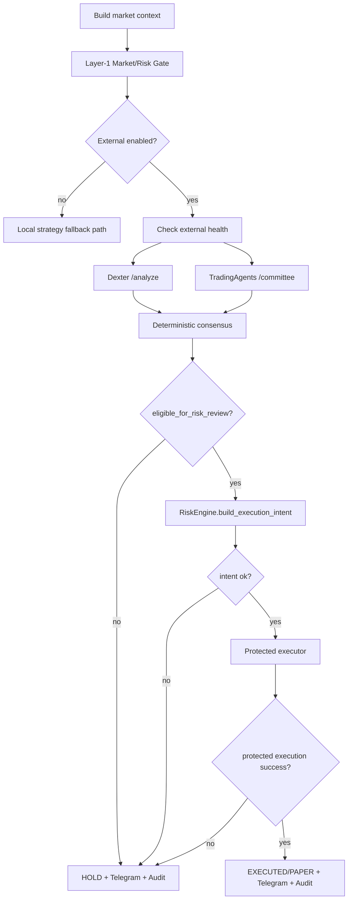

# Dexter + TradingAgents Integration (Production-Safe)

This document describes the **actual** integration in this repo.

## Core principle
- Dexter and TradingAgents are **analysis-only**.
- **Trade repo is sole execution authority** for paper/live decisions, risk checks, MT5 actions, Telegram outputs, and audit trail.

---

## End-to-End Flow



---

## JSON Contracts

## Dexter input
`POST /analyze`
```json
{
  "symbol": "XAUUSD",
  "market_context": {"...": "..."}
}
```

## Dexter output (required shape)
```json
{
  "symbol": "XAUUSD",
  "generated_at": "2026-03-29T12:00:00Z",
  "timeframe_bias": "bullish",
  "macro_summary": "...",
  "news_summary": "...",
  "fundamental_summary": "...",
  "technical_summary": "...",
  "conviction_score": 0.82,
  "do_not_trade": false,
  "invalidation_notes": "...",
  "risk_notes": "...",
  "summary_for_telegram": "...",
  "raw_payload": {}
}
```

## TradingAgents input
`POST /committee`
```json
{
  "symbol": "XAUUSD",
  "market_context": {"...": "..."}
}
```

## TradingAgents output (required shape)
```json
{
  "symbol": "XAUUSD",
  "generated_at": "2026-03-29T12:00:00Z",
  "action": "BUY",
  "confidence": 0.86,
  "bullish_thesis": "...",
  "bearish_thesis": "...",
  "technical_vote": "BUY",
  "sentiment_vote": "BUY",
  "news_vote": "HOLD",
  "risk_team_verdict": "pass",
  "portfolio_team_verdict": "pass",
  "do_not_trade": false,
  "summary_for_telegram": "...",
  "raw_payload": {}
}
```

---

## Consensus Rules (deterministic)
Implemented in `app/decision/consensus.py`:
1. Missing any report -> HOLD
2. Any `do_not_trade=true` -> HOLD
3. Map Dexter bias: bullish->BUY, bearish->SELL, neutral->HOLD
4. Dexter mapped action != committee action -> HOLD (conflict)
5. Committee action HOLD -> HOLD
6. Committee confidence < `CONSENSUS_MIN_CONFIDENCE` -> HOLD
7. Otherwise aligned -> actionable BUY/SELL

---

## Protected Order Execution Flow
Implemented in `app/execution/protected_executor.py`:
1. Re-validate valuation
2. Convert USD SL/TP -> points
3. Open order
4. Attach SL/TP to exact ticket immediately
5. If attach fails in live: safe containment (close ticket) and fail
6. Return structured result (`ProtectedExecutionResult`)

Result fields include:
- success, mode, symbol, action
- lot_size, stop_loss_usd, take_profit_usd
- stop_loss_points, take_profit_points
- ticket_id, protection_attached, reason

---

## USD SL/TP conversion
Source of truth is `RiskEngine`:
- `stop_loss_usd = (lot_size / 0.01) * USD_STOP_PER_0_01_LOT`
- `take_profit_usd = stop_loss_usd * RR_RATIO`
- `points = usd / (lot_size * point_value)`

Default values preserve expected behavior:
- 0.01 lot -> SL $5 / TP $15
- 0.02 lot -> SL $10 / TP $30

---

## Valuation ambiguity handling
- `STRICT_POINT_VALUE_VALIDATION=true`:
  - live: BLOCK
  - paper: depends on `PAPER_VALUATION_POLICY` (`warn`/`block`)
- Ambiguous means missing/invalid `point_value` or `point_size`.

No unsafe live fallback.

---

## Paper vs Live behavior
- **Paper:** simulated execution result, full audit + Telegram, protection marked true in simulation output.
- **Live:** execution only through MT5 adapter + mandatory immediate SL/TP attach (unless explicitly configured otherwise; default require protection).

---

## Telegram Message Examples
## HOLD example
`⏸ HOLD XAUUSD | reason=dexter and committee conflict | align=conflicting | dexter=bullish | committee=SELL | conf=0.00 | mode=live`

## EXECUTED example
`✅ EXECUTED XAUUSD BUY | align=aligned | lot=0.02 | SL=$10.00 | TP=$30.00 | protected=True | ticket=123456 | conf=0.84 | mode=live`

---

## Audit Lifecycle Coverage
Each cycle logs structured events (JSONL):
- analysis cycle / context snapshot
- external reports summaries
- unified decision
- risk intent result
- protected execution result
- rejection reason (if HOLD/block)

No secrets should be logged.

---

## Environment Variables and Defaults

```env
# External analysis agents
DEXTER_ENABLED=false
DEXTER_BASE_URL=http://dexter-service:8081
DEXTER_TIMEOUT_SECONDS=45
TRADING_AGENTS_ENABLED=false
TRADING_AGENTS_BASE_URL=http://tradingagents-service:8082
TRADING_AGENTS_TIMEOUT_SECONDS=60
CONSENSUS_MIN_CONFIDENCE=0.75

# Risk modes and sizing
RISK_MODE=balanced                # conservative|balanced|aggressive
RISK_PERCENT_PER_TRADE=0.02
MIN_LOT_SIZE=0.01
MAX_LOT_SIZE=1.0
USD_STOP_PER_0_01_LOT=5.0
RR_RATIO=3.0

# Safety guards
REQUIRE_PROTECTED_EXECUTION=true
STRICT_POINT_VALUE_VALIDATION=true
PAPER_VALUATION_POLICY=warn       # warn|block
```

---

## Operational Notes
- If Dexter or TradingAgents unavailable while enabled -> HOLD.
- If disagreement/conflict -> HOLD.
- If confidence below threshold -> HOLD.
- If valuation ambiguous in live -> BLOCK.
- Trade repo remains sole execution authority.


### Live routing guarantee
- Runner routes live orders through protected_executor only.
- If protected flow fails and `REQUIRE_PROTECTED_EXECUTION=true` (default), trade is blocked.
