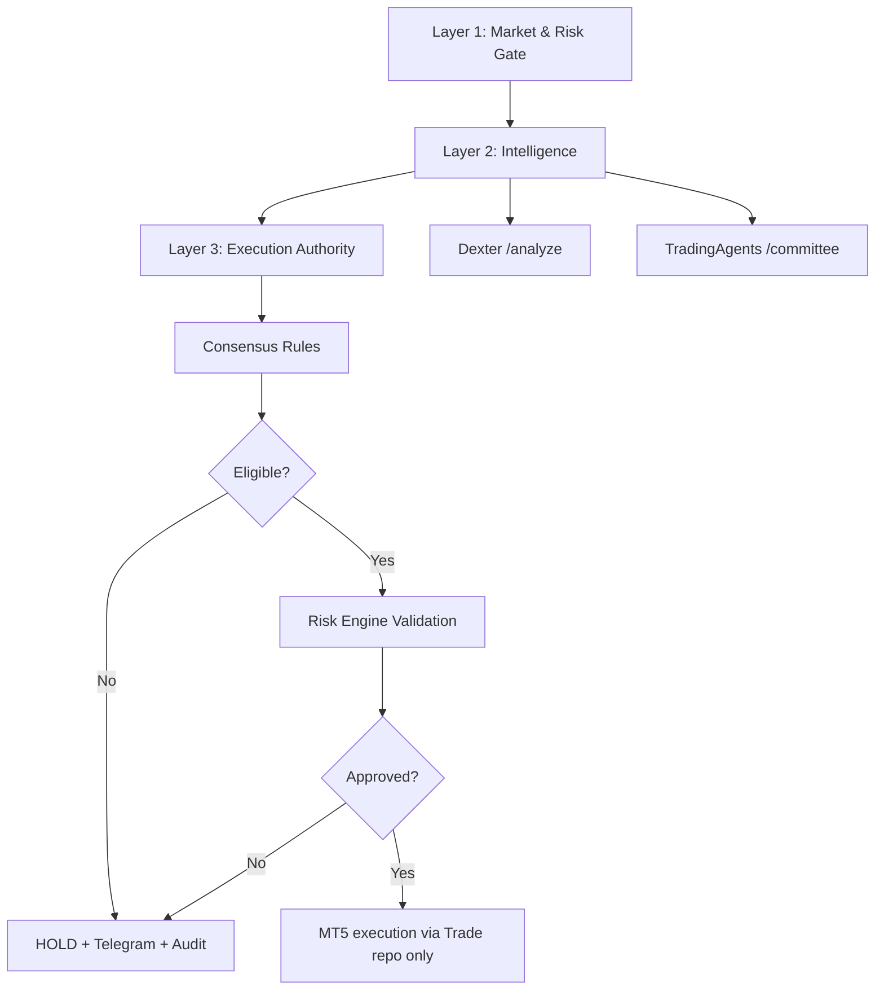

# Dexter + TradingAgents Integration (Analysis-Only)

## Safety Architecture



## Guarantees
- Trade repo is sole execution authority.
- Dexter and TradingAgents are analysis-only; they never place orders.
- HOLD is default on uncertainty/failure/conflict.
- Live mode hard-blocks ambiguous symbol valuation.

## External Service Contracts

### Dexter
- `POST /analyze`
- body:
```json
{ "symbol": "XAUUSD", "market_context": { } }
```

### TradingAgents
- `POST /committee`
- body:
```json
{ "symbol": "XAUUSD", "market_context": { } }
```

Optional health checks:
- `GET /health`

## Runner Decision Flow
1. Build market context.
2. Validate symbol metadata/valuation.
3. Check external health (if enabled).
4. Request Dexter + TradingAgents reports.
5. Build deterministic unified decision.
6. If ineligible -> HOLD + notify + audit.
7. If eligible -> risk review + execution intent.
8. Execute only through MT5 adapter (live) or simulate (paper).
9. Audit each stage.

## Environment Variables
- `DEXTER_ENABLED`
- `DEXTER_BASE_URL`
- `DEXTER_TIMEOUT_SECONDS`
- `TRADING_AGENTS_ENABLED`
- `TRADING_AGENTS_BASE_URL`
- `TRADING_AGENTS_TIMEOUT_SECONDS`
- `CONSENSUS_MIN_CONFIDENCE`
- `STRICT_POINT_VALUE_VALIDATION`
- `PAPER_VALUATION_POLICY`

## Paper Mode
- Executes paper simulation result notifications.
- With `PAPER_VALUATION_POLICY=block`, ambiguous valuation is blocked.
- With `PAPER_VALUATION_POLICY=warn`, warning is emitted and flow continues.

## Non-goals
- No direct broker integration from external agents.
- No bypass of Trade risk rules.
